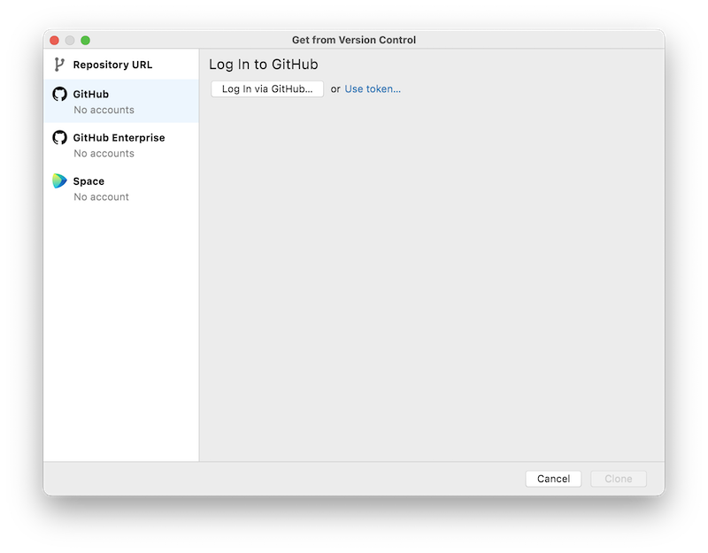
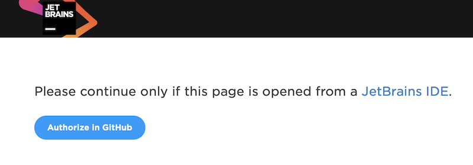
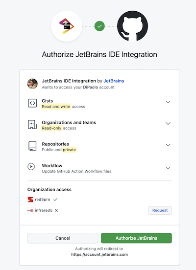
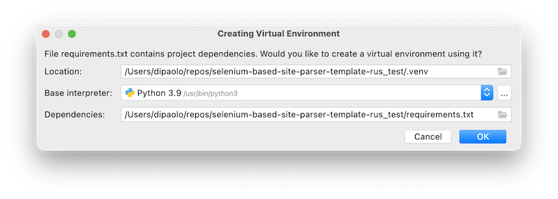

# Настроенный проект для парсинга сайтов с использованием Selenium + Python

## Как начать

### зарегистрироваться на GitHub

1. https://github.com

1. жамкаем кнопку `Sign Up` вверху справа

1. следуем указаниям

### установить PyCharm Community Edition (CE)

1. идем на https://www.jetbrains.com/pycharm/download

1. выбираем свою операционку

1. качаем версию `Community`

1. ставим как обычную программу

### создать новый проект

1. https://github.com/DiPaolo/selenium-based-site-parser-template-rus

1. выбрать Use Template и сделать репу себе

### открыть проект в PyCharm

1. запустить `PyCharm`

1. нажать кнопку `Get From VCS`

1. выбираем пункт слева `GitHub`
   

1. нажимаем `Log In via GitHub...`

1. нас перекинет в браузер

1. соглашаемся и нажимаем кнопку
   

1. опять соглашаемся и нажимаем кнопку внизу справа
   

1. возвращаемся в `PyCharm`, выбираем наш только что созданный проект из списка и нажимаем `Clone`

1. проект должен открыться в `PyCharm`; слева будут наши файлы проекта

1. PyCharm предложит создать виртуальное окружение Питона для конкретно этого проекта. Смело соглашайтесь
   
1. виртуальное окружение будет создано, а вместе с ним и все необходимые пакеты

1. через меню `Run->Run...` запустить программу

1. должно открыться окно Chrome и открыть сайт с текущим временем, затем подождать 5 секунд, в течение которых раз в 1-2 секунду будет выводиться текущее время, взятое прямо со страницы, а также сохраняться скриншот окна с текущим временем. После этого окно браузера закроется

🥳 👏
